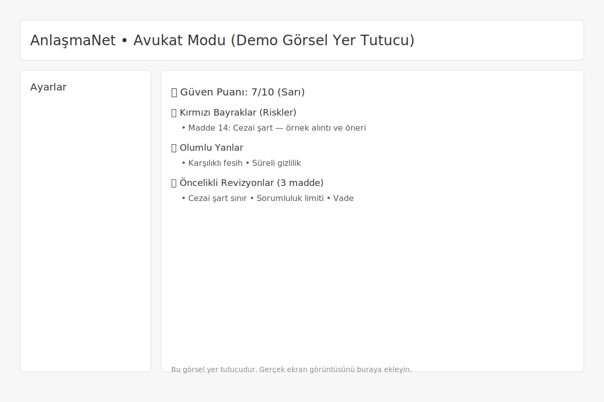
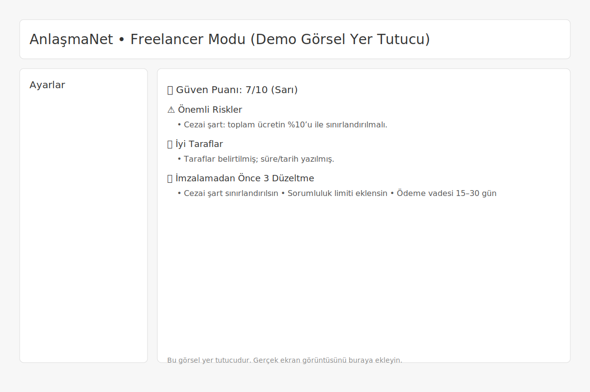

# AnlaşmaNet — Sözleşme Risk Analizi (Demo)

  

Minimal, profesyonel ve tamamen Türkçe bir sözleşme analizi demosu. PDF veya metin olarak verilen sözleşmeyi inceler; riskleri çıkarır, güven puanı üretir, "Freelancer" ve "Avukat" modlarında anlaşılır bir rapor oluşturur ve öncelikli 3 revizyonu önerir.

## Özellikler
- Türkçe risk tespiti ve puanlama (10 üzerinden güven puanı)
- İki sunum modu: `Freelancer` (basit, aksiyon odaklı) ve `Avukat` (analitik, madde odaklı)
- Özet bölümü ve "Öncelikli Revizyonlar (3 madde)"
- Dışa aktarma: `JSON`, `CSV`, `Markdown`, `HTML`, `Redline (.txt)`, `E‑posta taslağı (.txt)`
- PDF metin çıkarma ve hızlı çalıştırmalar için önbellekleme
- Minimal UI, tek akış: "Analiz Et"

## Ekran Görüntüleri



## Rozetler
- CI: Python smoke test (GitHub Actions)
- Dil: Türkçe analiz, Streamlit UI

## Hızlı Başlangıç
Önkoşullar: `Python 3.11`

```bash
py -3.11 -m pip install -r requirements.txt
py -3.11 -m streamlit run app.py
```

Tarayıcıda açılan arayüzde:
- PDF yükleyin veya metni yapıştırın
- `Hedef Kitle` ve `Demo Sözleşme` seçin (isteğe bağlı)
- `Analiz Et` düğmesine basın

## Çalışma Prensibi
- API anahtarı yoksa yerel analiz motoru devreye girer.
- API anahtarı ayarlıysa LLM analizi çağrılır, yerel analizle zenginleştirilir.
- Riskler ağırlıklarına göre sıralanır; ana riskler ve olumlu noktalar özetlenir.

## Dışa Aktarma
- `JSON`: Tam analiz çıktısı
- `CSV`: Risk listesi (madde, ad, ağırlık, öneri, alıntı)
- `Markdown/HTML`: Rapor
- `Redline (.txt)`: Madde düzeltme önerileri
- `E‑posta (.txt)`: Karşı tarafa iletilecek talep taslağı

## Notlar
- Bu bir demo uygulamadır; çıktı bilgilendirme amaçlıdır ve hukuki danışmanlık değildir.
- Proje minimal ve gösterim odaklıdır; gerçek sözleşmeler için uzman görüşüne başvurun.

## Teknoloji
- `Python`, `Streamlit`, `pdfplumber`, `requests`

## Katkı
Issue açarak hata/öneri bildirebilirsiniz. Küçük PR’lar memnuniyetle.

## Ekran Kartı / Kaynaklar
Yerel çalıştırma için 200MB’a kadar PDF desteği; RAM/CPU’ya bağlı olarak büyük dosyalarda bekleme süreleri artabilir.